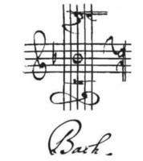

# El doble intèrpret de JSBach

Aquesta pàgina descriu la pràctica de GEI-LP (edició 2021-2022 Q2). La vostra tasca és implementar un doble intèrpret per a un llenguatge de programació musical anomenat JSBach. La sortida d'aquest doble intèrpret serà una partitura i uns fitxers de so que reproduiràn la melodia descrita pel compositor.

## Presentació del llenguatge JSBach

JSBach és un llenguatge de programació orientat a la composició algorísmica. Amb JSBach s'utilitzen construccions imperatives per generar composicions que donen lloc a partitures que poden ser desades en diferents formats digitals.

JSBach té moltes instruccions habituals. Aquest és el *Hallo Bach*:

```
~~~ Kleines Program in JSBach ~~~

Main |:
    <!> "Hallo Bach"
    <:> {B A C}
:|
```

Com podeu veure, els comentaris es troben entre triples titlles (`~~~`). No és necessari escriure els comentaris en alemany, però en Johann ho faria així.

Els programes es troben constituïts per procediments (l'ordre no importa) i, per defecte, comencen pel procediment `Main`.
Cada procediment té un nom, paràmetres (en aquest exemple no n'hi ha), i un bloc de codi associat. Els blocs es troben inscrits
entre els símbols `|:` i `:|`.

En JSBach, els procediments han de començar per una lletra majúscula. Les variables, en canvi, comencen amb una lletre minúscula. Els noms de notes, també són en majúscules.

La primera instrucció del programa `<!> "Hallo Bach"` és una instrucció d'escriptura (*write*).  La instrucció d'escriptura no és gaire útil per compondre, però és útil per debugar, perquè permet escriure textos (entre dobles cometes), enters i llistes.

La segona instrucció del programa `<:> {B A C}` és una instrucció de reproducció (*play*). Aquesta instrucció afegeix la nota o la llista de notes donades a la partitura. Les llistes es donen entre claus amb els seus elements separats per espais. En aquest cas, els elements són les notes músicals `B`, `A` i `C`. JSBach utilitza el sistema de notació musical anglès,
no el sistema de notació musical llatí ni el germànic. Així, aquest programa
genera la melodia Si, La, Do.

JSBach permet escriure programes senzills utilitzant enters de forma semblant als LPs habituals. Per exemple, el programa següent mostra com llegir dos nombres i calcular el seu màxim comú divisor utilitzant l'algorisme d'Euclides amb dos procediments i entrada/sortida:

```
~~~ programa que llegeix dos enters i n'escriu el seu maxim comu divisor ~~~

Main |:
    <!> "Escriu dos nombres"
    <?> a
    <?> b
    Euclides a b
:|

Euclides a b |:
    while a /= b |:
        if a > b |:
            a <- a - b
        :| else |:
            b <- b - a
        :|
    :|
    <!> "El seu MCD es" a
:|
```

Les variables són locals a cada invocació de cada procediment i els procediments es poden comunicar a través de paràmetres. Els procediments llisten els noms dels seus paràmetres formals, però no inclouen els seus tipus. Els paràmetres es separen amb blancs.

Les variables no han de ser declarades, i poden ser de tipus enter o llistes. Les notes músicals, es veurà més endavant, no són altra cosa que constants per a enters.

Com es veu a l'exemple, la sintaxi per llegir i escriure és utilitzant `<?>` i `<!>` respectivament. L'operador de comparació per igualtat és `=` i per diferència és `/=`.  L'assignació es fa amb la instrucció `<-`.

Com no podia ser d'altra manera, el llenguatge de programació JSBach compta amb recursivitat. Aquest programa mostra com solucionar el problema de les Torres de Hanoi:

```
Main |:
    <?> n
    Hanoi n 1 2 3
:|

Hanoi n ori dst aux |:
    if n > 0 |:
        Hanoi (n - 1) ori aux dst
        <!> ori "->" dst
        Hanoi (n - 1) aux dst ori
    :|
:|
```

Amb l'entrada `3` la sortida és doncs:

```
1 -> 2
1 -> 3
2 -> 3
1 -> 2
3 -> 1
3 -> 2
1 -> 2
```

Però, perquè quedar-se amb un mer llistat dels moviments? El programa següent compon una agradable melodia seguint el so dels discos movent-se, tot tocant la nota que es correspon al disc que es mou a cada pas:

```
~~~ Notes de Hanoi ~~~

Hanoi |:
    src <- {C D E F G}
    dst <- {}
    aux <- {}
    HanoiRec #src src dst aux
:|

HanoiRec n src dst aux |:
    if n > 0 |:
        HanoiRec (n - 1) src aux dst
        note <- src[#src]
        8< src[#src]
        dst << note
        <:> note
        HanoiRec (n - 1) aux dst src
    :|
:|
```

Canviant o afegint més notes a la llista orígen es poden compondre noves peces, ben agradables de sentir!

Al programa anterior es poden veure més operacions per a llistes:

-  `l[i]` consulta l'`i`-èsim element d'una llista `l`.
Com que JSBach és per a músics, els índexs de les llistes comencen per 1.

- `l << x` afegeix l'element `x` al final de la llista `l`.

-  `#l` retorna la llargada de la llista `l`.

- `8< l[i]` retalla (elimina) l'`i`-èsim element d'una llista `l`.
`8<` es coneix com *der Scherenoperator* (l'operador de tisores).

En JSBach els paràmetres funcionen com en Python: els enters es passen per còpia, les llistes es passen per referència.


# Especificació de JSBach

Les instruccions de JSBach són:

- l'assignació amb `<-`,
- la lectura amb `<?>`,
- l'escriptura amb `<!>`,
- la reproducció amb `<:>`,
- la invocació de procediments,
- el condicional amb `if` i potser `else`,
- la iteració amb `while`,
- l'afegit a llistes amb `<<`.
- el tall de llistes amb `8<`.

Les instruccions escrites una rera l'altra s'executen seqüencialment.


## Assignació

L'assignació ha d'avaluar primer l'expressió a la part dreta del `<-` i emmagatzemar després el resultat a la variable local a la part esquerra. Exemple: `a <- a - b`. En el cas d'assignar llistes, cal copiar els valors (sense fer aliasing). Per senzillesa, a la part esquerra d'una assignació només pot aparèixer una variable (no es pot fer, per exemple, l[2] <- 5).


## Lectura

La instrucció de lectura ha de llegir un valor enter del canal d'entrada estàndard i enmagatzemar-lo a la variable a la dreta del `<?>`. Exemple: `<?> x`.


## Escriptura

La instrucció d'escriptura ha d'avaluar l'expressió del `<!>` i escriure-la, en una línia, al canal de sortida estàndard. Exemple: `<!> x + y`. En el cas d'escriure una llista, cal escriure tots els seus valors entre claudàtors i separats per comes. `<!>` pot contenir diversos paràmetres, cal escriure cadascun d'ells a la mateix línia, separats per espais. Els paràmetres poden contenir textos (tancats entre cometes dobles). Els textos no apareixen en cap altre lloc.


## Reproducció

La instrucció de reproducció ha d'avaluar l'expressió del `<:>`. Si és una nota, l'ha d'afegir a la partitura, amb el valor d'una negra (diferents valors de notes com blanques, rodones o corxeres es deixen per a JSBach2). Si és una llista, ha d'afegir cadascuna de les seves notes (d'esquerra a dreta).


## Condicional

La instrucció condicional té la semàntica habitual. El bloc del sinó és optatiu. Exemples: `if x == y |: z <- 1 :|` i `if x == y |: z <- 1 :| else |: z <- 2 :|`. Fixeu-vos que els limitadors dels blocs sempre són obligatoris (tant als condicions com als procediments i als `while`s).


## Iteració amb `while`

La instrucció iterativa amb `while` té la semàntica habitual. Exemple: `while a > 0 |: a <- a / 2 :|`.


## Invocació de procediment

La crida a un procediment té la semàntica habitual.  
Si el nombre de paràmetres passats
no corresponen als declarats, es produeix un error. Els procediments no són
funcions i no poden retornar resultats. Però els procediments es poden cridar
recursivament. La sintàxi és com a Haskell: sense parèntesis ni comes.
Exemple: `Escriu x + y 2`.


## Expressions

Si una variable encara no ha rebut cap valor, el seu valor és zero. Els
operadors aritmètics són els habituals (`+`, `-`, `*`, `/`, `%`) i amb la
mateixa prioritat que en C. Evidentment, es poden usar parèntesis. El operadors
relacionals (`=`, `/=`, `<`, `>`, `<=`, `>=`) retornen zero per fals i u per
cert (Boole és posterior a Bach).


## Llistes

Les llistes s'escriuen entre claudàtors, amb els seus elements separats per comes. Els elements de les llistes només poden ser enters (o notes, que no són altre cosa que constants enteres). Les llistes es passen per referència.
`#l` retorna la llargada de la llista `l`.
`l[i]` consulta l'`i`-èsim element d'una llista `l`; cal que `i` es trobi entre 1 i `#l`.
`l << x` afegeix l'element `x` al final de la llista `l`.
`8< l[i]` elimina l'`i`-èsim element d'una llista `l`;
també cal que `i` es trobi entre 1 i `#l`.


## Àmbit de visibilitat

No importa l'ordre de declaració dels procediments. Les variables són locals a
cada invocació de cada procediment. No hi ha variables globals ni manera
d'accedir a variables d'altres procediments (només a través dels paràmetres).


## Notes

JSBach proporciona uns noms que representen les notes blanques d'un piano (els sostinguts i bemolls es deixen per JSBach2). Les tres primeres notes són A0 (La0), B0 (Si0), C1 (Do1). Les tres darreres són A7 (La7), B7 (Si7), C8 (Do8). A https://ca.wikipedia.org/wiki/Freq%C3%BC%C3%A8ncies_del_piano teniu una explicació d'aquesta nomemclatura). A més, les notes C, D, E, F, G, A, B
(sense número) son sinónims de C4 (Do central), D4, E4, F4, G4, A4, B4. Les notes de JSBach no són altra cosa que constants, de manera que A0 val 0, B0 val 1, ... i C8 val ???. Així, es pot transposar una nota una octava més amunt o més avall sumant-li o restant-li 7 unitats.

El procediment següent tocaria totes les tecles blanques del piano
de més greu a més aguda (d'esquerra a dreta):

```
Alle_Schlüssel |:
    note <- A0
    while note <= C8 |:
        <:> note
        note <- note + 1
    :|
:|
```

## Errors

Malgrat que JSBach és força senzill, els programes poden causar molts errors en temps d'execució. Per aquesta pràctica, només us demanem que detecteu els errors més verosímils (divisió per zero, crida a procediment no definit, repetició de procediment ja definit, nombre de paràmetres incorrectes, noms de paràmetres formals repetits, accés a un índex inexistent d'una llista...) i que el programa llanci amb una excepció quan es donen. No heu de fer una anàlisi semàntica per errors de tipus.


## Invocació de l'intèrpret

El vostre intèrpret s'ha d'invocar amb la comanda `python3 jsbach.py` tot
passant-li com a paràmetre el nom del fitxer que conté el codi font
(l'extensió dels fitxers per programes en JSBach és `.jsb`). Per exemple:

```bash
python3 jsbach.py musica.jsb
```

Si es vol començar des d'un procediment diferent del `Main`, es pot donar el seu nom com a paràmetre. Per exemple:

```bash
python3 jsbach.py musica.jsb Hanoi
```

Si el programa s'executa correctament, es generaran els fitxers
`musica.pdf` amb la partitura en format PDF,
`musica.midi` amb la música en format MIDI,
`musica.wav` amb la música en format WAV,
i
`musica.mp3` amb la música en format MP3.

Si ho voleu, també podeu fer que la música es toqui al final del programa.


## Extensions

Podeu extendre el llenguatge amb construccions del vostre gust, a condició de mantenir una compatibilitat estricta amb l'especificació donada (i ser barrocs). A més, cal que documenteu amb precisió les vostres extensions i que creeu programes que les provin i posin de manifest la seva utilitat.

Per exemple, podríeu extendre JSBach amb accidentals (notes amb sostinguts o bemolls), operadors lògics, funcions que retornin valors, funcions d'ordre superior...

Compte: Les extensions poden portar molta feina, consulteu-les abans amb el vostre professor.


## Llibreries

Utilitzeu  `ANTLR` per escriure la gramàtica i l'intèrpret. Podeu utilitzar lliurament qualsevol llibreria estàndard de Python.


## Programes externs

Per generar les partitures, heu d'utilitzar el programa LilyPond.
Lilypond ja genera MIDI i PDF.
Per generar WAV a partir de MIDI heu d'utilitzar `timidity++`.
Per generar MP3 a partir de WAV heu d'utilitzar `ffmpeg`.
Tots aquests programes es poden instal·lar facilment en Mac, Linux i (suposo) Windows. El vostre programa es corregirà en un entorn on els binaris `lilypond`, `timidity` i `ffmpeg` es troben al *path*.


## Breu demostració dels programes externs

LilyPond és un programa de tipografia musical.
És programari lliure i forma part del Projecte GNU.
Les partitures es descriuen a partir d'un llenguatge prou complex, però del quan només us cal saber uns rudiments per fer aquesta pràctica.

Per exemple, aquest programa `exemple.lily` en LilyPond descriu una escala
amb buit negres (Do, Re, Mi, Fa, Sol, La, Si, Do) a un tempo de 120:

```
\version "2.22.1"
\score {
    \absolute {
        \tempo 4 = 120
        c'4 d'4 e'4 f'4 g'4 a'4 b'4
    }
    \layout { }
    \midi { }
}
```

Quan hom executa

```bash
lilypond exemple.lily
```

Lilipond genera `exemple.pdf` i `exemple.midi` (perquè s'ha donat les comandes `\layout` i `\midi` respectivament).

TiMidity++ és un altre programa de codi obert que transforma fitxers MIDI en fitxers de so, com ara fitxers WAV. Es pot executar així

```bash
timidity -Ow -o exemple.wav exemple.midi
```

per tal d'obtenir el fitxer `exemple.wav`.

El programa lliure `ffmpeg` permet convertir entre diferents formats de vídeo i audio. Es pot executar així

```bash
ffmpeg -i exemple.wav -codec:a libmp3lame -qscale:a 2 exemple.mp3
```

per tal d'obtenir el fitxer `exemple.mp3`.

Finalment, els fitxers MP3 es poden reproduir amb molts reproductors de so. En un Mac, es pot fer així des de la línia de comandes:

```bash
afplay exemple.mp3
```  

# Referències

- Johann Sebastian Bach: https://ca.wikipedia.org/wiki/Johann_Sebastian_Bach

- ANTLR en Python: https://gebakx.github.io/Python3/compiladors.html#1

- Lilypond: https://lilypond.org

- Timidity++: https://en.wikipedia.org/wiki/TiMidity%2B%2B

- ffmpeg: https://www.ffmpeg.org/


